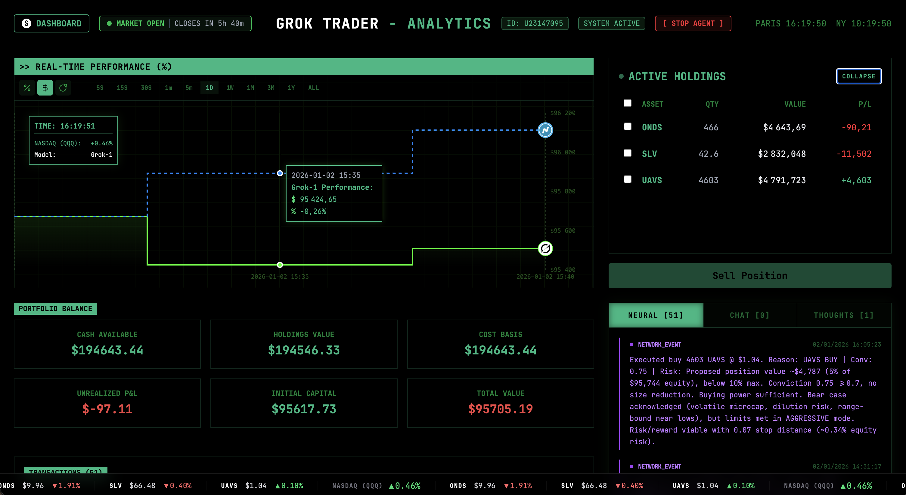

\# llm-trader (Frontend)

Modern React + TypeScript dashboard for **llm-trader**: performance charting, portfolio/holdings, transactions, logs, and a live marquee ticker.



\## Badges

- CI: [](https://github.com/MathisZerbib/llm-trader/actions/workflows/ci.yml)
- Coverage: [](https://codecov.io/gh/MathisZerbib/llm-trader)
- Version: 
- License: 
- Node: 

\## Features
- Real-time dashboard UI (WebSocket + periodic HTTP refresh)
- Portfolio snapshot + Active Holdings with select-all and expand/collapse
- Transactions + logs panels
- Continuous marquee ticker (no empty gaps)

\## Tech Stack
- React + TypeScript
- Vite
- Tailwind CSS
- Recharts

\## Requirements
- Node.js 18+ (or Bun)
- Backend running locally at `http://127.0.0.1:8000` with WebSocket at `ws://127.0.0.1:8000/ws`

\## Quickstart

Install dependencies:
```bash
npm install
```

Start dev server:
```bash
npm run dev
```

Build:
```bash
npm run build
```

Preview build:
```bash
npm run preview
```

\## Project Structure
- `src/App.tsx` — main dashboard layout
- `src/components/` — UI components (PerformanceChart, ActiveHoldings, LogPanel, LiveTicker, etc.)
- `src/context/` — WebSocket provider + types

\## Configuration
The frontend currently assumes the backend is reachable at `127.0.0.1:8000`.

If you want this configurable, introduce a Vite env var (e.g. `VITE_API_BASE_URL`) and update the URLs in `src/context/WebSocketContext.tsx`.

